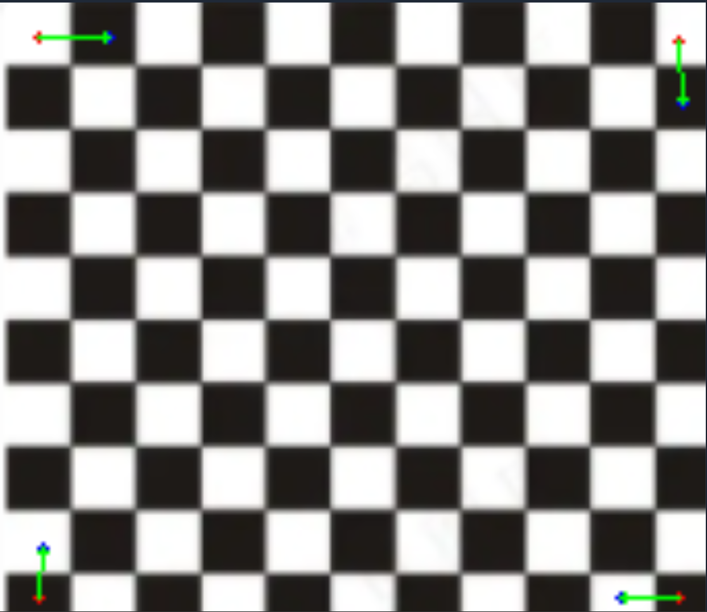
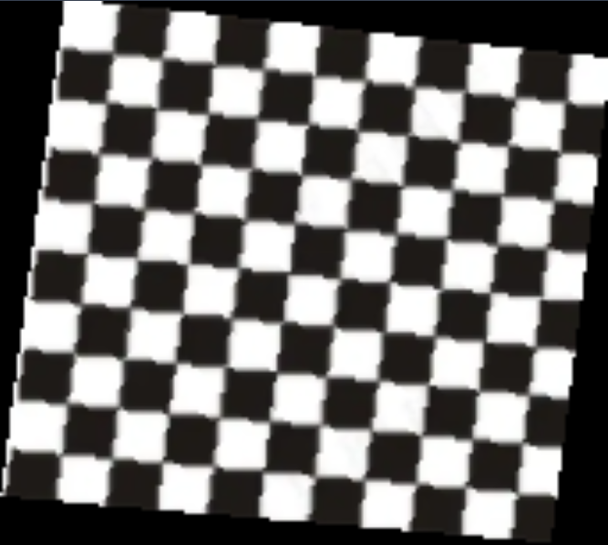
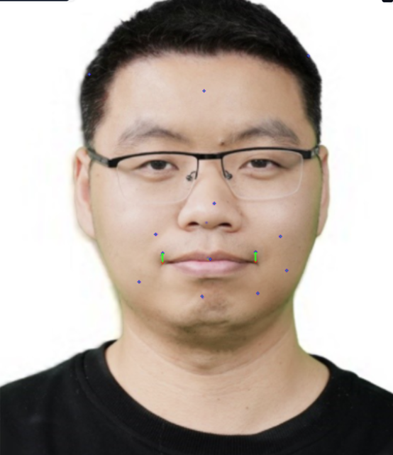
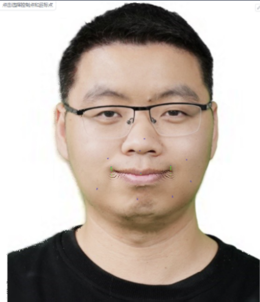

# 实验一

本次实验实现了两个主要功能：
1. **基本图像几何变换**：包括图像的缩放、旋转和平移。
2. **基于点的图像变形**：通过定义和操作图像中的特定点，实现图像的扭曲和变形。

以上功能均通过Gradio界面提供交互式操作。

## 目录
- [实验一](#实验一)
  - [目录](#目录)
  - [概述](#概述)
  - [安装步骤](#安装步骤)
  - [使用方法](#使用方法)
  - [实验结果](#实验结果)
  - [参考文献](#参考文献)

## 概述
本项目旨在演示如何对图像进行几何变换和基于点的变形。用户可以通过Gradio界面上传图像，并实时对其进行各种变换操作。

项目主要分为两部分：
- **全局图像变换**：对整个图像进行缩放、旋转和平移操作。
- **基于点的变形**：用户可在图像上定义控制点，拖动这些点以实现图像的局部变形。


## 安装步骤

要在本地运行该项目，请按照以下步骤进行：

1. 克隆仓库：
    ```bash
    git clone <仓库地址>
    cd <项目文件夹>
    ```

2. 安装所需依赖：
    ```bash
    pip install -r requirements.txt
    ```

3. 运行Gradio应用：
    ```bash
    python run_global_transform.py
    python run_point_transform.py
    ```

## 使用方法

1. **全局图像变换**：
   - 运行`python run_global_transform.py`启动Gradio界面。
   - 上传一张图像，使用滑动条调整图像的缩放、旋转和平移参数。

2. **基于点的图像变形**：
   - 运行`python run_point_transform.py`启动点变形工具。
   - 在图像上定义控制点，拖动这些点以实现图像的局部变形。

## 实验结果

1. **全局图像变换:**


2. **基于点的图像变形**
<p align="center">
  <figure style="display: inline-block; margin: 10px;">
    
    <figcaption>图1：黑白格图片原图。</figcaption>
  </figure>

  <figure style="display: inline-block; margin: 10px;">
    
    <figcaption>图2：变换后的黑白格图片。</figcaption>
  </figure>
</p>

<p align="center">
  <figure style="display: inline-block; margin: 10px;">
    
    <figcaption>图3：郭玉东老师照片。</figcaption>
  </figure>

  <figure style="display: inline-block; margin: 10px;">
    
    <figcaption>图4：变换后的照片。</figcaption>
  </figure>
</p>

## 参考文献
1. [S.Schaefer, T.McPhail, "Image Deformation Using Moving Least Squares"](https://people.engr.tamu.edu/schaefer/research/mls.pdf)
2. [N.Arad,  N.Dyn, "Image Warping by Radial Basis Functions Application to Facial
Expressions"](https://www.sci.utah.edu/~gerig/CS6640-F2010/Project3/Arad-1995.pdf)


