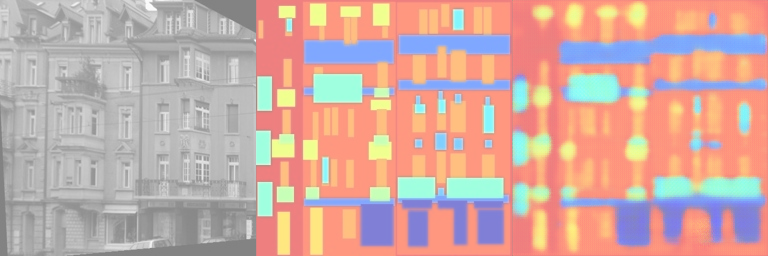

# 实验报告

## 目录
- [实验报告](#实验报告)
  - [目录](#目录)
  - [实验二：泊松图像融合与Pix2pix实现](#实验二泊松图像融合与pix2pix实现)
    - [概述](#概述)
    - [安装步骤](#安装步骤)
    - [使用方法](#使用方法)
    - [实验结果](#实验结果)
  - [参考文献](#参考文献)

## 实验二：泊松图像融合与Pix2pix实现

### 概述

本实验实现了泊松图像融合和建筑物图像上色两个功能。用户在第一部分可以通过 Gradio 界面对图片进行融合操作，实验还利用 pix2pix 框架进行建筑物上色。具体内容包括：
1. **泊松图像融合**：在 Gradio 界面选取图像的控制多边形区域，将两张图片在该区域中进行融合，优化 Laplacian loss，得到自然融合的图片。
2. **建筑物上色**：利用 pix2pix 框架，实现建筑物图像的自动上色，并完成 Fully Convolutional Network 的部分代码以生成训练和测试图像。

### 安装步骤

要在本地运行该项目，请按照以下步骤进行：

1. 下载第二部分的训练数据集：
    ```bash
    bash download_facades_dataset.sh
    ```

2. 运行泊松图像融合程序：
    ```bash
    python run_blending_gradio.py
    ```

3. 运行 Pix2pix程序：
    ```bash
    python train.py
    ```

### 使用方法

1. **泊松图像融合**：
   - 运行 `python run_blending_gradio.py` 启动 Gradio 界面。
   - 上传两张图像，选择控制多边形区域生成 Mask。
   - 使用泊松图像融合算法计算 Mask 区域中的 Laplacian loss，并通过 Adam Optimizer 进行训练，生成融合图像。

2. **Pix2pix实现**：
   - 运行 `python train.py` 启动 pix2pix 上色工具。
   - 选择建筑物图像数据集，利用 pix2pix 完成模型训练。
   - 使用训练好的模型生成建筑物的上色图像。

### 实验结果

1. **泊松图像融合**：
    <div style="text-align: center;">
    
    <p>图1：背景图片</p>
    </div>

    <div style="text-align: center;">
    
    <p>图2：前景图片</p>
    </div>

    <div style="text-align: center;">
    
    <p>图2：前景图片</p>
    </div>

    <div style="text-align: center;">
    
    <p>图3：融合后的图片</p>
    </div>
    


2. **Pix2pix实现**：
   <div style="text-align: center;">
    
    <p>图4：epoch为20时训练结果</p>
    </div>

    <div style="text-align: center;">
    
    <p>图5：epoch为100时训练结果</p>
    </div>

    <div style="text-align: center;">
    
    <p>图6：epoch为500时训练结果</p>
    </div>

   

## 参考文献
1. [P.Perez, M.Gangnet, "Poisson Image Editing"](https://www.cs.jhu.edu/~misha/Fall07/Papers/Perez03.pdf)
2. [J.Long,  E.Shelhamer, "Fully Convolutional Networks for Semantic Segmentation"](https://arxiv.org/abs/1411.4038)
